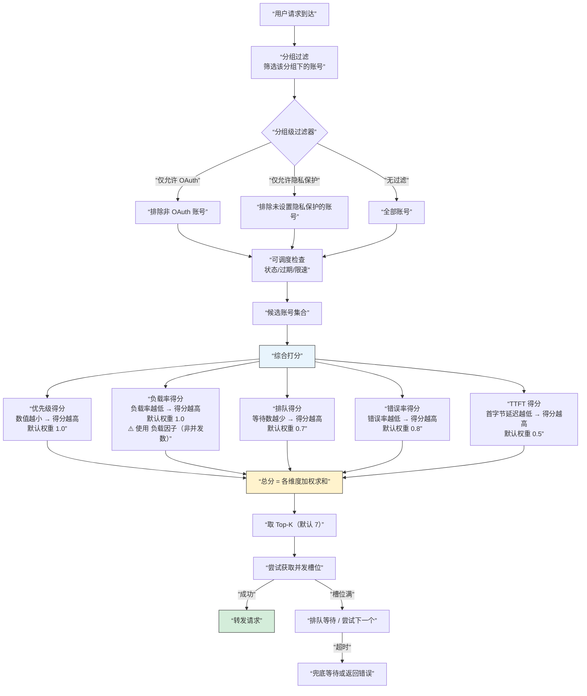
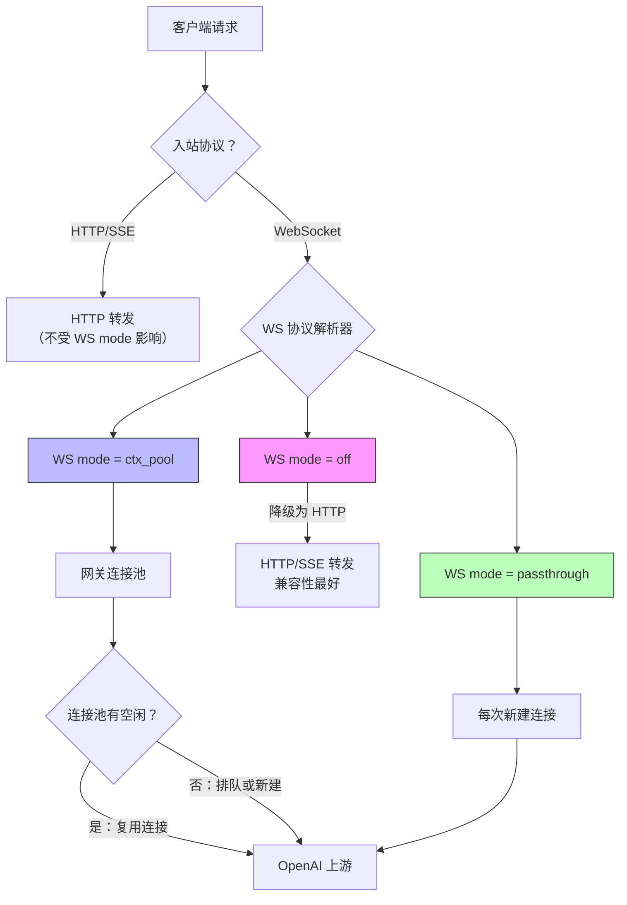

# 关键模型参数设置

本文面向 Sub2API 管理员，专门解释账号管理、分组管理，以及 OpenAI `/v1/messages` 调度里最容易配错的一批参数。重点不是“字段字面意思”，而是“什么情况下建议怎么配”。

## 先记住 4 个判断原则

- 不确定时，优先选更保守、更稳定的配置，不要一上来把并发和调度权重拉满。
- `账号参数` 主要决定”这一个上游号怎么被调度、怎么记账、什么时候停用”。
- `分组参数` 主要决定”用户看到什么入口、怎么收费、哪些账号可以进入这个池子”。
- 如果你已经开始用”账号实际成本 + 分组额外盈利率”，就尽量不要再靠手算分组倍率去逼近利润目标。

## 账号调度决策全景

下面的流程图展示了账号参数如何影响每一次请求的调度决策：



**关键洞察**：从流程可以看到，`优先级`、`负载因子`、`并发数` 三个参数分别在打分阶段、负载计算阶段、槽位获取阶段发挥作用。它们不是替代关系，而是串联协作。

## 账号类型先搞清楚

Sub2API 支持多种上游账号类型，其中最容易混淆的是 **OAuth 账号** 和 **API Key 账号**。下面涉及的很多参数（WS mode、仅允许 Codex 客户端、仅允许 OAuth 账号等）都和账号类型直接相关。

### 什么是 OpenAI OAuth 账号？

OpenAI OAuth 账号是通过 **OpenAI OAuth 2.0 授权流程**获取凭据的账号，而不是手动填一个 `sk-...` 的 API Key。

**和 API Key 账号的核心区别**：

| | **API Key 账号** | **OAuth 账号** |
|---|---|---|
| **认证凭据** | 一串静态 API Key（`sk-...`） | OpenAI OAuth 授权后获得的 access_token + refresh_token |
| **来源** | OpenAI 平台后台手动生成 | 通过 OpenAI 登录授权（和 Codex CLI、ChatGPT 用的是同一套 OAuth 流程） |
| **Token 管理** | 不需要刷新，永久有效直到手动删除或到期 | access_token 会过期，系统自动用 refresh_token 续期 |
| **能访问什么** | API 付费额度内的模型 | 绑定的 ChatGPT Plus/Pro/Team 订阅权益，包括 Codex 等高级模型 |
| **典型场景** | 标准 API 调用 | Codex CLI 专用、ChatGPT 订阅权益转发、需要高并发的业务场景 |

一句话理解：**API Key 是"用 OpenAI 发的钥匙直接开门"，OAuth 账号是"借用一个真实用户的登录会话来调用 API"**。

### OAuth 账号是怎么添加的？

管理员在后台添加 OpenAI 账号时，可以选择多种方式：

| 方式 | 说明 | 适合场景 |
|------|------|---------|
| **浏览器 OAuth 授权** | 系统生成授权链接，管理员点击后跳转到 OpenAI 登录页完成授权 | 最正规、最推荐的方式 |
| **手动输入 Refresh Token** | 直接粘贴已有的 refresh_token，系统自动换取 access_token | 从其他工具迁移、批量导入 |
| **手动输入 Mobile RT** | 输入移动端的 refresh_token | 从移动端获取的 token |
| **Session Token** | 直接导入已有的 session token | 特殊场景 |
| **Access Token** | 直接导入 access token | 临时使用，无自动续期能力 |

授权完成后，系统会自动提取以下信息：
- **邮箱**：该 OpenAI 账号的绑定邮箱
- **套餐类型**（plan_type）：Plus / Pro / Team / Free 等
- **组织 ID**：OpenAI 组织信息
- **订阅到期时间**：ChatGPT 订阅的到期日期
- **隐私保护**：系统会自动尝试关闭训练数据共享

### OAuth 账号为什么"更值钱"？

在调度和运营中，OAuth 账号通常比 API Key 账号更有价值，原因：

- **访问更多模型**：能调用 Codex、o 系列等仅限订阅用户的模型
- **更高并发能力**：订阅账号通常有比 API Key 更宽松的并发限制
- **支持 WebSocket**：可以使用 WS mode（ctx_pool / passthrough），对 Codex CLI 等场景有更低延迟
- **Token 自动续期**：refresh_token 机制让账号长期可用，不需要人工换 key

这也是为什么系统提供了 `仅允许 OAuth 账号`、`仅允许 Codex 官方客户端` 等过滤器——帮管理员把高价值的 OAuth 号和普通 API Key 号隔离开来。

## 账号管理

### 并发数

这个值是账号的实际并发槽位上限。值越大，系统允许同时挂在这个账号上的请求越多。

**代码默认值**：`3`（新建账号时自动填入）

**推荐值速查**：

| 场景 | 推荐范围 | 说明 |
|------|---------|------|
| 新号 / 稳定性未知 | 1~3 | 先保守观察，再逐步调高 |
| 普通稳定号 | 3~5 | 大多数 API Key 账号的合理区间 |
| 高质量 / 已验证抗压 | 5~10 | 确认上游能承受后再设 |
| OAuth 高并发池 | 8~15 | 需配合负载监控逐步调 |
| WS ctx_pool 模式 | 3~8 | 该值同时作为 WS 连接池上限 |

**调参节奏**：先从默认 `3` 开始 → 观察排队/超时 → 每次加 2~3 → 稳定 24h 再决定是否继续加。

不建议这样配：

- 把它当成”越大越快”的性能参数。
- 在没有压测和观察的情况下，直接给所有账号同一个很高的值。

一句话理解：

`并发数` 决定的是”最多扛多少同时进行的请求”，不是”想让它多被选中多少次”。

### 负载因子

这个值影响调度器如何感知该账号”忙不忙”。系统计算负载率时，优先用 `负载因子`；如果不填、填 0 或填负数，都会回落到 `并发数`。

因此它的作用是：

- `提高负载因子`：在不改变真实并发上限的前提下，让这个账号看起来”更没那么忙”，从而更容易被继续选中。
- `留空`：按 `并发数` 参与负载计算，最直观。

**代码行为**（`EffectiveLoadFactor()`）：

```
负载因子 > 0 → 使用负载因子
负载因子 ≤ 0 或为空 → 使用并发数
并发数也为 0 → 兜底为 1
```

**推荐值速查**：

| 场景 | 并发数 | 负载因子 | 效果 |
|------|--------|---------|------|
| 不理解这个参数 | 3 | **留空** | 等同并发数 3，最安全 |
| 高质量号想多接流量 | 5 | 8~10 | 看起来比实际更空闲，调度优先级提升 |
| 主力号积极调度 | 5 | 12~15 | 显著倾斜流量到该号 |
| 稀缺 OAuth 号全力调度 | 8 | 15~20 | 最大化利用该号 |

**关键约束**：负载因子只影响调度倾向，不改变真实并发上限。如果并发数是 5 而负载因子是 15，第 6 个请求开始仍然要排队等槽位释放。

不建议这样配：

- 为了”提高吞吐”只改 `负载因子`，却不看真实并发是否已经接近上限。
- 把质量一般的号也配很高的 `负载因子`，这样会让调度器过度偏爱它。

一句话理解：

`并发数` 管真实上限，`负载因子` 管调度倾向。

### 优先级

数值越小，优先级越高。调度时会先看优先级，再看负载率，再看最近是否使用过。

**代码默认值**：`50`（新建账号和账号加入分组时自动填入）

**调度器行为**：在候选账号集合内做 min-max 归一化。假设候选集的优先级范围是 10~80，那么 `10` 的号优先级得分最高，`80` 最低，`50` 居中。所有号都是默认 `50` 时，优先级维度不产生区分，完全由负载、排队、错误率等维度决定。

**推荐值速查**：

| 场景 | 推荐值 | 说明 |
|------|--------|------|
| 普通号（默认） | **50** | 不需要改，与其他号公平竞争 |
| 主力高质量号 | 10~20 | 明确优先调度 |
| 备用号 | 70~80 | 主力号可用时不会被选中 |
| 兜底号 | 90~100+ | 仅在所有其他号都不可用时才调度 |

**常见分层方案**：

| 层级 | 优先级 | 占比 | 角色 |
|------|--------|------|------|
| 第一梯队 | 10~20 | 20%~30% | 主力号，优先承接流量 |
| 第二梯队 | 50（默认） | 40%~60% | 普通号，负载均衡 |
| 第三梯队 | 80~100 | 10%~20% | 备用/兜底号 |

不建议这样配：

- 每个号都手动配成不同优先级，最后自己都看不懂调度层次。
- 所有号都设成极小值（如都设 `1`），这等于没分层。

### 账号计费倍率

这个参数只影响“账号口径”的记账与配额消耗，不直接决定用户余额怎么扣。

已知行为：

- `1`：按原始 usage 成本记账
- `0`：该账号按 0 记账
- 大于 `1`：账号侧成本/配额消耗按比例放大

建议这样配：

- 大多数正常账号保持 `1`。
- 只在你明确知道自己要做“账号内部成本核算”或“账号配额特殊折算”时改它。
- 需要临时把某个账号设成“测试不计费号”时，可以设为 `0`，但要确认这符合你的运营意图。

不建议这样配：

- 误以为它能直接提高对用户的售价。

### 账号实际成本

这里填的是该账号的真实采购成本，单位是人民币。系统会结合这个账号累计的真实 usage，用来推算“每 1 USD 官方 usage 大概对应你多少人民币成本”。

这个参数最适合和 `分组 -> 额外盈利率(%)` 配合使用。

建议这样配：

- 当你能明确说出“这个号买回来花了多少钱”时再填。
- 同类账号采购价差异很大时，尽量逐个填写，不要用一个假平均数糊过去。
- 如果你准备按“真实成本 + 目标利润率”来收费，这个字段最好填。

不建议这样配：

- 乱填一个估算值，然后再指望利润面板是准的。
- 把它当成“用户售价”填写。

重要说明：

- 仅填 `账号实际成本` 还不够。
- 只有当分组也配置了 `额外盈利率(%)` 时，标准余额计费才会优先走“真实成本 + 额外利润率”的收费路径。

### 自动透传（仅替换认证）

当前截图里有两类：

- OpenAI 账号的自动透传
- Anthropic API Key 账号的自动透传

它们的共同点是：请求和响应尽量原样透传，只替换认证，同时保留计费、并发、审计和必要安全过滤。

建议开启的场景：

- 你要尽量贴近上游原生协议行为。
- 某些客户端对兼容层很敏感，更适合直接透传。

建议关闭的场景：

- 你更依赖现有兼容链路里的模型改写、白名单、协议适配。
- 正在排查兼容性问题，想先回到更稳的旧逻辑。

特别注意：

- OpenAI 开启自动透传后，模型白名单和模型映射不会生效。
- OpenAI 自动透传只影响 HTTP 透传链路，不会把 `WS mode` 一起关掉。

### WS mode

#### 先理解：什么是 WebSocket？

普通 HTTP 请求像打电话：每次说完一句，挂断，想再说就得重新拨号。

WebSocket 像保持通话：双方建立连接后可以持续双向对话，不用反复拨号。适合需要长时间、多轮交互的场景。

OpenAI 的 Responses API 支持用 WebSocket 传输请求，相比传统 HTTP/SSE 有更低延迟和更好的双向通信能力。

#### WS mode 解决什么问题？

当客户端（如 Codex CLI、ChatGPT 网页端）通过 WebSocket 发起请求时，网关需要决定怎么把请求转发到 OpenAI 上游。三种模式对应三种转发策略：



#### 三种模式对比

| | **off** | **ctx_pool** | **passthrough** |
|---|---|---|---|
| **一句话** | 不用 WebSocket，走 HTTP | 网关统一管理 WS 连接池 | 每次请求直接透传给上游 |
| **连接管理** | 不涉及 | 网关维护连接池，跨请求复用 | 不复用，每次新建 |
| **并发控制** | HTTP 并发 | 连接池上限 = 账号 `并发数` | 不受连接池控制 |
| **多轮对话** | 无状态 | 支持 previous_response_id 粘连 | 透传给上游处理 |
| **性能** | 最低（每次建立 HTTP） | 最高（连接复用） | 中等（每次建连） |
| **兼容性** | 最好 | 好 | 最贴近上游原生行为 |
| **适用场景** | WS 不稳定时兜底 | 高并发、多轮对话 | 需要原生行为、排查问题 |

#### 推荐配置

| 场景 | 推荐模式 | 说明 |
|------|---------|------|
| 不理解 WS 是什么 | **off** | 最安全，全部走 HTTP |
| 高并发 OpenAI 账号池 | **ctx_pool** | 连接复用降低延迟 |
| Codex CLI 专用账号 | **ctx_pool** | 多轮对话依赖连接复用 |
| 排查 WS 兼容性问题 | **passthrough** | 排除网关中间层干扰 |
| 低并发、少量 OAuth 号 | **passthrough** | 简单直接，无需管理连接池 |

额外提醒：

- `ctx_pool` 模式下，账号的 `并发数` 会成为该账号 WS 连接池上限。例如并发数 5 → 最多维护 5 条 WS 连接。
- `passthrough` 模式不使用连接池，改大并发数不会增加 WS 连接数。
- `shared` 和 `dedicated` 是旧版模式，已自动归并为 `ctx_pool`。
- WS mode 只影响 **OpenAI 平台账号**，Anthropic / Gemini 等平台不适用。

#### 并发数设置参考

OpenAI OAuth 账号的上游并发能力取决于账号等级，OpenAI 未公开精确数字且会动态调整。以下为经验参考值：

| 账号等级 | 建议并发数 | 说明 |
|---------|-----------|------|
| Free | 1-2 | 上游容量极小，不建议用于生产 |
| Plus | 3-5 | 超过 5 容易触发 429 或连接断开 |
| Team | 5-10 | 相对宽裕，但仍需观察 |
| Enterprise / Pro | 10+ | 上游容量最大，可适当调高 |

调参建议：从小值起步，观察日志中是否有上游限流错误（429、连接被踢），再逐步上调。如果 `ctx_pool` 里连接频繁断连或请求大面积超时，说明并发数已超过上游承受能力，应下调。

### 仅允许 Codex 官方客户端

这个开关只对 `OpenAI OAuth` 账号生效。

开启后，这个账号只接受 Codex 官方客户端家族访问。适合把高价值的 OAuth 号专门留给 Codex 用。

建议开启的场景：

- 这是专门给 Codex CLI / Codex 官方客户端留的号。
- 你不希望普通脚本、第三方客户端或杂流量消耗这批号。

建议关闭的场景：

- 这批 OAuth 号要混合服务多种 OpenAI 客户端。
- 你当前更重视可用性和兼容性，而不是访问来源隔离。

关闭后，OAuth 账号可以被任何客户端使用，包括 LobeChat、ChatBox 等通用聊天客户端。系统会自动完成协议转换：

**请求方向**：LobeChat 等客户端发的是标准 `/v1/chat/completions` 格式，系统会自动将其转换为 OpenAI Responses API 格式，再投递到 ChatGPT 内部端点。转换内容包括：`messages[]` → `input[]`、`system` 消息提取到 `instructions`、`tools[]` 格式适配等。

**响应方向**：上游返回的 Responses API 流式事件会被实时转换回 ChatCompletions 格式（`response.output_text.delta` → `choices[0].delta.content`），用户看到的就是标准的流式聊天效果，包括多轮对话和工具调用都正常工作。

**注意**：由于 OAuth 上游（ChatGPT 内部 API）的限制，`temperature`、`max_output_tokens` 等参数会被自动忽略，但不影响正常聊天功能。

### 过期自动暂停调度

开启后，只要账号到了过期时间，系统会自动把它视为不可调度。

建议开启的场景：

- 账号有明确到期时间。
- 你不想让过期号继续被调度，避免报错或浪费排障时间。

建议关闭的场景：

- 账号虽然写了过期时间，但实际上你只是拿它做提醒，不希望系统自动停用。

一般建议：

- 只要 `过期时间` 是可信数据，就建议开启。

### OpenAI OAuth 用量窗口

在账号列表中，OpenAI OAuth 账号会显示一个用量窗口，实时展示该账号在 OpenAI 官方速率限制下的使用情况。所有数字均从 OpenAI Codex API 自动获取，不是软件写死的。

#### 数据来源

系统通过 ChatGPT Codex API（`https://chatgpt.com/backend-api/codex/responses`）发起探测请求，从响应头中的 `x-codex-*` 字段解析出用量数据。成功响应缓存 3 分钟，错误缓存 1 分钟。

#### 窗口期

OpenAI 对 OAuth 账号设有一快一慢两个滑动窗口：

| 窗口 | 时长 | 说明 |
|------|------|------|
| **5h** | 5 小时 | 短期速率限制窗口，每 5 小时重置 |
| **7d** | 7 天 | 长期用量上限窗口，每 7 天重置 |

每个窗口独立计算用量百分比和重置倒计时，任一窗口达到 100% 都会触发限速。

#### 用量指标

每个窗口下方会显示四项统计指标：

| 显示 | 含义 | 说明 |
|------|------|------|
| **1.8K req** | 请求数 | 该窗口内已发出的 API 请求总量，来自平台自身用量日志 |
| **202.3M** | Token 数 | 该窗口内消耗的 token 总量（百万级），来自平台自身用量日志 |
| **A $84.98** | 账号口径计费（Account Billed） | 平台按上游计费标准核算的成本，即该账号实际消耗的金额 |
| **U $97.55** | 用户口径扣费（User Billed） | 平台按用户计费标准核算的费用，即向平台用户收取的金额 |

一句话理解：**A 是"这个号花了多少钱"，U 是"用户被扣了多少钱"**。通常 A ≤ U，差值就是平台的利润空间。鼠标悬停在 A / U 上可看到"账号计费""用户扣费"的提示文字。

#### 进度条与重置倒计时

每个窗口有一个进度条：

- **百分比**：当前窗口已用量占上限的比例（如 0%、73%、100%）
- **颜色**：随用量升高从蓝/绿变为黄色，接近满时变红
- **倒计时**：显示距离该窗口额度恢复的剩余时间（如"4h 14m"）
- **"现在"标记**：当窗口用量为 0% 时，会显示"现在"表示刚重置

当 7d 窗口显示红色 100% 时，说明该账号已在 7 天周期内用完全部额度，需要等待倒计时结束后才能恢复。这是管理员判断"这个号还能不能接流量"的重要依据。

### API Key 账号新增的 3 个错误处理开关

这 3 个参数主要是给 `API Key` 类账号用的，核心不是“性能调优”，而是“上游出错时，本地网关到底要不要把这个账号判坏”。

如果你把账号类型理解成下面三类，判断就会简单很多：

| 场景 | 池模式 | 自定义错误码 | 临时不可调度 | 推荐原因 |
|---|---|---|---|---|
| 官方直连 OpenAI / Anthropic / Gemini API Key | **关** | **关** | 按需开 | 保留系统默认的 401/403/402/429/529 处理，最稳 |
| 这个“账号”背后其实是另一个 Sub2API / 代理池 / 二级网关 | **开** | 通常关 | **关** | 把坏号判断交给上游池，本地不要重复判错 |
| 第三方代理会返回固定 HTTP 码，且你很清楚语义 | 关 | **谨慎开** | 按需开 | 只对你确认过的错误码做本地停调 |

先记住一个组合关系：

- `池模式` 开启后，默认不会再做本地错误标记，也不会走本地临时不可调度。
- `自定义错误码` 一旦开启并开始选码，本质上是在告诉系统：只有这些状态码值得按本地策略处理。
- `临时不可调度` 只有在“你仍然希望本地自己判定临时坏号”时才有意义。

#### 池模式

一句话理解：

这个开关适合“上游本身就是一个账号池”的场景，而不是“我手里有一个普通官方 API Key”。

开启后，账号在遇到上游 `401 / 403 / 429` 等可重试错误时，不会直接把本地账号标记为错误、限流或不可调度，而是优先在**同一个账号**上重试。默认重试 `3` 次，最多 `10` 次，填 `0` 表示不做原地重试。

建议开启的场景：

- 这个 `base_url` 指向的是另一个 `Sub2API`、`OneAPI` 或类似的二级网关
- 你配置的“一个账号”背后其实是上游维护的账号池，而不是单个真实 key
- 你希望本地网关把错误判断交给上游，不要因为上游池里某个瞬时错误就把这条入口永久打坏

不建议开启的场景：

- 这是 OpenAI / Anthropic / Gemini 官方直连 API Key
- 你希望本地一旦收到 `401`、`403`、`402` 等错误，就立即把坏 key 停掉
- 这个分组本来就只有 1 个 API Key，开启后收益很小，反而会增加排障延迟

推荐值：

- 上游号池场景：`池模式 = 开`，`同账号重试次数 = 1~3`
- 官方直连场景：`池模式 = 关`

额外提醒：

- `池模式` 和“本地精细治理坏号”是两套思路，通常不要同时当主策略使用。
- 如果你开了 `池模式` 却忘了这个号其实是官方直连 key，那么坏 key 可能不会被及时标记，表现就是同一个号反复报错。

#### 自定义错误码

一句话理解：

这个开关不是“新增更多容错”，而是“收窄哪些错误码值得本地停调”。

真实行为是：

- 关闭时：系统按默认逻辑处理常见错误，例如 `401 / 403 / 402 / 429 / 529`
- 开启但**一个码都不选**：仍然等同默认逻辑
- 开启且**选了具体错误码**：只有命中的错误码才继续走本地处理；没选中的错误码不会标记账号，通常直接向客户端返回 `500`

建议开启的场景：

- 你接的是第三方代理，它会用某几个固定 HTTP 状态码表示“这个入口应该停掉”
- 你已经通过日志确认，某个错误码在你的上游里确实代表“账号不可继续使用”

不建议开启的场景：

- 你还没搞清楚上游的错误语义，只是想“多勾一点看看”
- 你依赖系统默认的 `429` 限流冷却、`529` 过载冷却、`401/403` 认证停调逻辑

推荐写法：

- 不确定时：`关`
- 只想保留默认逻辑但先把开关打开看看：可以开，但**不要选任何错误码**
- 真的要做精细控制时：只填你确认过的少数几个码，不要铺一长串

特别注意：

- 把 `429` 加进去，系统就不会再把它当“临时限流”处理，而会按“应停调”处理。
- 把 `529` 加进去，系统也不会再按“临时过载”处理。
- 所以对大多数管理员来说，`429` 和 `529` 更适合留给默认逻辑，不适合塞进自定义错误码。

#### 临时不可调度

一句话理解：

这是给“临时性坏号”用的冷却规则，不是给“永久失效 key”用的。

命中规则必须同时满足两件事：

- HTTP `错误码` 匹配
- 返回体里包含你设置的任一 `关键词`

并且规则是**按顺序匹配**的，先命中的先生效。

建议开启的场景：

- 你有多个 API Key 账号，想在 `429 / 503 / 529` 这类临时波动时，先把当前号冷却几分钟
- 上游经常出现带固定文案的临时错误，例如 `rate limit`、`maintenance`、`overloaded`

不建议开启的场景：

- 分组里只有 1 个账号，冷却后也没有其他号可切
- 你想拿它处理 `401` 这类通常代表永久失效的 API Key 错误
- 你已经用 `池模式` 把错误治理交给上游池

推荐预设：

| 错误码 | 关键词示例 | 冷却时长 | 适合场景 |
|---|---|---|---|
| `429` | `rate limit`, `too many requests` | `10` 分钟 | 临时限流 |
| `503` | `unavailable`, `maintenance` | `30` 分钟 | 上游维护或暂时不可用 |
| `529` | `overloaded`, `too many` | `60` 分钟 | 上游过载 |

更稳的实战建议：

- 先从预设开始，不要一上来写很复杂的关键词组合。
- `关键词` 要尽量选上游返回里稳定出现的短词，不要写整句。
- `401` 对 API Key 来说通常更像永久问题，不建议放进临时不可调度规则。

#### 这三个开关怎么一起判断

如果你只想记一个结论，可以直接照下面做：

- 官方直连 API Key：`池模式关` + `自定义错误码关` + `临时不可调度按需给 429/503/529`
- 上游是另一层网关或号池：`池模式开` + `同账号重试 1~3` + 其他两个通常先关
- 第三方代理且错误码语义很明确：`池模式关` + `自定义错误码只填确认过的码` + `临时不可调度只处理临时性报错`

不确定时，优先选择更保守的组合：

- `池模式 = 关`
- `自定义错误码 = 关`
- `临时不可调度 = 先不开，或只用 429/503/529 预设`

## 分组管理

### 从分组复制账号

这个功能用于快速复用其它分组的账号绑定关系。

创建分组时：

- 会把所选同平台分组里的账号复制到新分组
- 多个来源分组的账号会自动去重

编辑分组时：

- 会替换当前分组现有的全部账号绑定
- 这不是“追加一点”，而是“用来源分组的账号集合整体覆盖”

建议这样用：

- 新建一个“VIP 分组”“镜像分组”“协议兼容分组”时，快速继承已有账号池。
- 大规模重整分组时，用它快速对齐账号集合。

不建议这样用：

- 你只是想补几个号，却直接在编辑态执行复制，结果把原绑定全覆盖了。

### 额外盈利率(%)

这个参数只用于 `标准（余额）` 计费分组。

当它和 `账号实际成本` 同时存在时，系统会优先按下面的思路收费：

- 先根据账号真实成本和真实 usage，估算这次请求的人民币成本
- 再按 `额外盈利率(%)` 加价
- 然后换算成最终扣除的余额金额

因此它更适合表达：

- “我希望这个分组整体保持 20% / 40% / 80% 的利润空间”

而不是表达：

- “我手工算出来这个分组倍率应该写多少”

建议这样配：

- 你已经比较认真地维护了账号实际成本时，用它。
- 想统一控制利润率，而不是天天手动换算倍率时，用它。

**推荐值速查**：

| 场景 | 推荐范围 | 举例 | 说明 |
|------|---------|------|------|
| 保守定价 / 薄利多销 | 10%~20% | 15% | 竞争力强，利润薄 |
| 常规定价 | 20%~40% | 30% | 兼顾利润和竞争力 |
| 高价值 / 稀缺资源 | 40%~80% | 50% | 独家模型、稀缺号源 |
| 企业定制 / VIP | 80%~150% | 100% | 含服务溢价、SLA 保障 |

**计算示例**：账号实际成本推算出一次请求的人民币成本为 0.10 元，额外盈利率设为 30%，则用户扣费 = 0.10 × (1 + 30%) = 0.13 元。

不建议这样配：

- 账号实际成本没填，却想靠它得到准确盈利结果。
- 订阅分组还想用它；订阅分组本身就不是这个收费模型。

### 专属分组

开启后，这个分组不会作为公开分组直接给所有用户看到，通常需要管理员手动授予给特定用户。

建议开启的场景：

- VIP 用户专属
- 企业客户专属
- 内测分组
- 特价分组，不希望普通用户直接选到

建议关闭的场景：

- 公开售卖的普通分组
- 希望用户在创建 API Key 或购买时直接看到的标准入口

### 状态

一般优先保持 `正常`。如果分组还要继续对外使用、继续承接请求、继续被套餐引用，就不要随便停掉。

建议这样配：

- 正在服务中的分组：`正常`
- 需要临时下线、排障、迁移的分组：改为非正常状态，再做后续调整

### 计费类型

这个字段决定分组是：

- `标准（余额）`
- `订阅（配额）`

而且创建后不能修改，所以创建前要想清楚。

#### 标准（余额）

适合：

- 用户余额按次扣费
- API 站常规售卖
- 想按 usage 实时结算

常见搭配：

- `账号实际成本 + 额外盈利率(%)`
- 或传统 `分组倍率` 方案

#### 订阅（配额）

适合：

- 月包、周包、固定套餐
- 希望给用户日/周/月额度上限

已知特性：

- 会改为配额式用量控制，不走标准余额扣费逻辑
- `额外盈利率(%)` 不再适用
- UI 会把这类分组默认收敛到更适合订阅的配置

## OpenAI `/v1/messages` 调度配置

这部分只对 `OpenAI` 平台分组有意义。

### 允许 `/v1/messages` 调度

开启后，这个 OpenAI 分组可以接 Anthropic Messages 风格请求，也就是能作为 Claude 协议兼容入口。

建议开启的场景：

- 你希望这个 OpenAI 分组被 `Claude Code`、Anthropic SDK 或其它 Claude 协议客户端直接使用。
- 你想让用户仍然用 Claude 模型名，但底层实际消费 GPT / Codex 模型。

建议关闭的场景：

- 这组就是纯 OpenAI 原生分组。
- 你不想让用户把这组 Key 当成 Claude 兼容入口。

一句话判断：

只要这组 Key 需要承接 Claude 协议客户端，就开启。

### 系列默认映射

当前界面是按 Claude 系列做默认映射：

- `Opus`
- `Sonnet`
- `Haiku`

推荐理解方式：

- `Opus` 映射到更高能力模型
- `Sonnet` 映射到主力通用模型
- `Haiku` 映射到更轻、更便宜、更快的模型

你截图里的一个典型例子是：

- `Opus -> gpt-5.4`
- `Sonnet -> gpt-5.3-codex`
- `Haiku -> gpt-5.4-mini`

这类映射适合：

- 需要保持“大致能力梯度”
- 希望用户仍按 Claude 系列心智使用

### 精确模型覆盖

精确映射优先级高于系列默认映射。

适合的场景：

- 你只想把某个具体 Claude 型号单独改到另一个目标模型
- 大多数 Sonnet 走默认映射，但 `claude-sonnet-4-5-20250929` 想单独指向别的模型

建议这样配：

- 默认靠“系列映射”兜底
- 只有在你明确知道某个具体型号需要特殊处理时，再加精确覆盖

不建议这样配：

- 上来就把所有型号都拆成精确映射，后面维护会很累

### 仅允许 OAuth 账号

这是分组级账号过滤器，不是用户侧权限开关。

开启后：

- 只有 OAuth 类型账号能进入并参与这个分组
- API Key 类型账号会被排除

建议开启的场景：

- 这个分组就是专门服务 OAuth 体系账号池
- 你想把 OAuth 池和 API Key 池彻底隔离

建议关闭的场景：

- 你需要混用 OAuth 和 API Key 账号
- 当前可用号不多，不想因为类型过滤让池子变小

### 仅允许隐私保护已设置的账号

#### 什么是”隐私保护”？

OpenAI 默认会把用户对话内容用于模型训练（即 ChatGPT 设置中的”改善每个人的模型”）。Sub2API 在添加 OAuth 账号时，会**自动尝试关闭这个开关**，确保通过该账号产生的对话不会被 OpenAI 用于训练。

这个动作等同于在 ChatGPT 网页端手动操作：

**设置 → 数据控制 → 改善每个人的模型 → 关闭**

#### 系统是怎么自动完成的？

1. 管理员通过 OAuth 授权添加 OpenAI 账号后，系统拿到 access_token
2. 系统自动调用 OpenAI 的账户设置 API：

   ```
   PATCH https://chatgpt.com/backend-api/settings/account_user_setting
   ?feature=training_allowed&value=false
   ```

3. 根据返回结果，账号被标记为以下状态之一：

| 状态 | `extra.privacy_mode` 值 | 含义 |
|------|------------------------|------|
| 已完成 | `training_off` | 成功关闭训练数据共享 |
| 设置失败 | `training_set_failed` | API 调用失败，未关闭 |
| 被 CF 拦截 | `training_set_cf_blocked` | CloudFlare 安全策略阻止了请求 |

4. 后台 token 刷新服务会在每次续期时**自动重试**未成功的账号

#### 判断标准

一个账号是否算”已完成隐私保护”，**唯一标准**是：

- OpenAI 账号：`extra.privacy_mode == “training_off”`
- 其他平台（Anthropic、Gemini 等）：无隐私保护概念，始终视为已通过

管理员可以在账号详情的扩展信息中看到 `privacy_mode` 的值。如果显示 `training_off`，说明隐私保护已成功设置。

#### 如何确保所有账号都完成隐私保护？

- **优先使用 OAuth 授权方式添加账号**：系统会自动尝试设置
- **手动输入 token 的账号**：系统会在后台 token 刷新时自动补设
- **API Key 账号**：不涉及隐私保护（API Key 没有训练数据共享机制），不受此过滤器影响
- **检查方式**：查看账号列表中 `privacy_mode` 字段是否为 `training_off`；如果有 `training_set_failed` 或 `training_set_cf_blocked`，说明需要关注

#### 后台操作教程

**第一步：查看账号隐私状态**

在管理后台的 **账号列表** 页面，每个 OpenAI / Antigravity OAuth 账号旁边会显示一个彩色状态徽标：

| 徽标颜色 | 显示内容 | 含义 |
|----------|---------|------|
| 绿色 + ✓ | `Private` | 已成功关闭训练数据共享 |
| 红色 + ✗ | `Fail` | 关闭失败，训练可能仍开启 |
| 黄色 + ✗ | `CF` | 被 Cloudflare 拦截，训练可能仍开启 |
| 无徽标 | — | 未尝试设置（或非 OAuth 账号） |

**第二步：按隐私状态筛选账号**

账号列表上方的筛选栏中有一个 Privacy 状态下拉框，可以快速筛选：

- **全部 Privacy 状态**：显示所有账号
- **未设置**：只显示从未尝试过隐私保护的账号
- **Privacy**：只显示已成功设置的账号
- **CF**：只显示被 Cloudflare 拦截的账号
- **Fail**：只显示设置失败的账号

**第三步：手动触发隐私设置**

对于 OpenAI 或 Antigravity OAuth 账号，如果隐私保护未成功（显示红色 `Fail` 或黄色 `CF`），可以手动重试：

1. 在账号列表中找到目标账号
2. 点击账号右侧的 **操作菜单**（⋯ 或右键）
3. 选择 **”设置隐私”**（盾牌图标）
4. 系统会立即重新调用上游 API 尝试关闭训练数据共享
5. 成功后徽标会变为绿色 `Private`；失败会显示错误提示

注意：

- 该按钮仅对 OpenAI OAuth 和 Antigravity OAuth 账号显示
- API Key 账号没有此按钮（API Key 不涉及训练数据共享）
- 如果反复失败，可能是该账号的网络环境（代理/CF 策略）导致的，需要排查网络配置

**第四步：在分组中强制要求隐私保护**

如果你希望某个分组只使用已完成隐私保护的账号：

1. 进入 **分组管理** → 创建或编辑分组
2. 找到 **”仅允许隐私保护已设置的账号”** 开关
3. 开启后，该分组调度时会自动排除 `privacy_mode != “training_off”` 的账号

#### 分组过滤器行为

这也是分组级账号过滤器。开启后（分组 `require_privacy_set = true`），只有 `privacy_mode == “training_off”` 的账号才能参与调度。未达标的账号会被自动跳过并标记异常。

适合开启的场景：

- 企业客户
- 敏感业务
- 你明确承诺了”训练关闭 / 隐私保护已设置”

适合先关闭的场景：

- 账号池还在整理
- 当前首要目标是保证可用账号数量

一句话理解：

- `仅允许 OAuth 账号` 是筛账号类型
- `仅允许隐私保护已设置的账号` 是筛账号合规状态

## 三套实用推荐模板

### 公共稳定分组

适合：默认售卖、普通用户、公网流量

| 参数 | 推荐值 |
|------|--------|
| 账号 `并发数` | 3~5 |
| 账号 `优先级` | 50（默认，不分层） |
| 账号 `负载因子` | 留空 |
| 账号 `计费倍率` | 1.0 |
| 分组 `额外盈利率(%)` | 20%~30%（需配合账号实际成本） |
| 分组 `状态` | 正常 |
| OpenAI WS mode | off（或给少量稳定号开 ctx_pool） |
| `/v1/messages` 调度 | 关闭（纯 OpenAI 原生分组时） |
| `仅允许隐私保护已设置的账号` | 等账号治理完成后再开 |

### 高质量或 VIP 分组

适合：高单价用户、企业客户、你想控制体验的流量

| 参数 | 推荐值 |
|------|--------|
| 主力号 `并发数` | 5~10 |
| 主力号 `优先级` | 10~20 |
| 主力号 `负载因子` | 并发数 ×1.5~2（如并发 8 → 负载因子 12~16） |
| 所有号 `账号实际成本` | 逐个填写真实采购价 |
| 分组 `额外盈利率(%)` | 40%~80% |
| 分组 `专属分组` | 开启 |
| OpenAI WS mode | ctx_pool（高并发场景） |

### Codex 专用 OpenAI OAuth 分组

适合：专门给 Codex 官方客户端使用的 OpenAI OAuth 号池

| 参数 | 推荐值 |
|------|--------|
| 账号 `仅允许 Codex 官方客户端` | 开启 |
| 账号 `并发数` | 5~8 |
| 账号 WS mode | ctx_pool（Codex CLI 依赖多轮对话） |
| 分组 `允许 /v1/messages` 调度 | 如需承接 Claude 协议客户端则开启 |
| 分组 `仅允许 OAuth 账号` | 开启（如果这批号只收 OAuth） |
| `Opus / Sonnet / Haiku` 默认映射 | 按能力梯度配置 |

## 最后给管理员的简化判断

如果你只想快速决策，可以直接按下面判断：

- 想让一个号“最多扛多少同时请求”：改 `并发数`
- 想让一个号“更容易被调度到”：改 `负载因子` 或 `优先级`
- 想按真实采购成本控利润：填 `账号实际成本`，分组再配 `额外盈利率(%)`
- 想让 OpenAI 分组兼容 Claude 客户端：开 `允许 /v1/messages` 调度
- 想做 VIP / 内测 / 企业专享：开 `专属分组`
- 想把高价值 OAuth 号只留给 Codex：开 `仅允许 Codex 官方客户端`

如果后续你还想把“渠道管理”或“订阅管理”里的关键参数也并到同一篇文档，可以继续按这个结构往下补。
